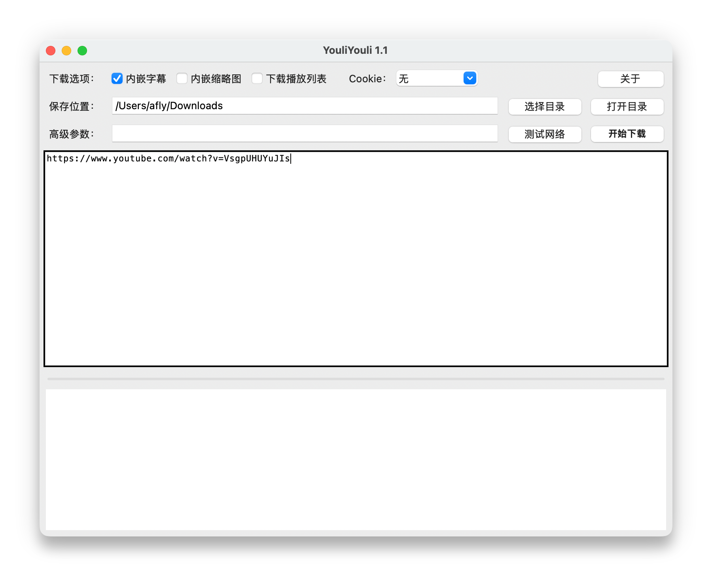

# YouliYouli

## 一、应用简介

YouliYouli 是一款在 **macOS / Windows11** 上运行的视频下载应用，通过内置的 **yt-dlp**、**ffmpeg**、**Node** 等组件，从网络获取视频流并保存到本地。应用免费使用，请自行遵守视频所在平台的**服务条款**与**版权法律**。

## 二、主要功能

| 功能 | 说明 |
|------|------|
| **字幕** | 可选内嵌字幕（自动字幕多语言，含中英相关语言代码）。 |
| **缩略图** | 可选内嵌封面图（若源站提供）。 |
| **播放列表** | 默认仅下载单条视频；勾选「下载播放列表」后，可下载完整播放列表。 |
| **保存位置** | 默认用户「下载」文件夹，可浏览修改，并支持在 Finder 中打开。 |
| **批量地址** | 主界面大文本框内**每行一个**链接；开始下载前会记住列表。 |
| **开始/停止** | 同一按钮切换：下载进行中显示为「停止」。 |
| **高级参数** | 一行内填写额外传给 yt-dlp 的参数（空格分隔，含引号时需成对，规则与终端一致）。 |
| **网络测试** | 使用本机 `curl` 探测访问 YouTube 的连通性；若你在高级参数里填写了 `--proxy`，测试会尝试使用该代理。 |
| **Cookie** | 下拉可选浏览器（Chrome / Edge / Firefox / Safari）或指定本地 cookies.txt 文件；用于解决需要登录验证的视频。 |
| **配置存盘** | 设置保存在用户主目录 **`~/.youliyouli/config.conf`**（含目录、高级参数、视频列表等）。 |

## 三、Mac安装步骤

1. **下载解压**

   从 https://github.com/xiaomac/YouliYouli/releases 下载最新版 `YouliYouli_mac_x64.zip`，双击解压后会得到 **`YouliYouli.app`**。将 `YouliYouli.app` 拖入 **访达** → **应用程序** 文件夹。

2. **设置Cookie**

   为解决反爬取机制导致的解析错误问题，可能需要手动选择浏览器如 Chrome、Edge、Firefox、Safari 等的 Cookie 数据，系统会弹出 **钥匙串** 确认框，选择 **总是允许** 即可。

## 四、Win安装步骤

1. **下载解压**

   从 https://github.com/xiaomac/YouliYouli/releases 下载最新版 `YouliYouli_win11_x64.zip`，解压后会得到 **`YouliYouli`** 文件夹，直接运行目录下的 `YouliYouli.exe` 即可。

2. **设置Cookie**

   为解决反爬取机制导致的解析错误问题，需要手工指定 Cookie 文件，可以安装插件 [Get cookies.txt LOCALLY](https://chromewebstore.google.com/detail/cclelndahbckbenkjhflpdbgdldlbecc) 来获得。
   插件使用方法：浏览器安装后，打开视频页面，输出格式选 Netscape，点击 Export，即可得到 xxx_cookies.txt。
